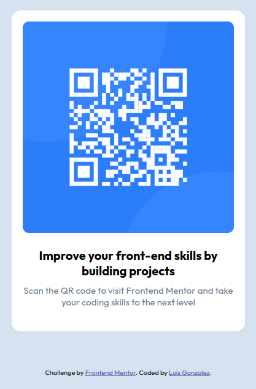

# Frontend Mentor - QR code component solution

This is a solution to the [QR code component challenge on Frontend Mentor](https://www.frontendmentor.io/challenges/qr-code-component-iux_sIO_H). Frontend Mentor challenges help you improve your coding skills by building realistic projects. 

## Table of contents

- [Overview](#overview)
  - [Screenshot](#screenshot)
  - [Links](#links)
- [My process](#my-process)
  - [Built with](#built-with)
  - [What I learned](#what-i-learned)
  - [Continued development](#continued-development)
- [Author](#author)

## Overview

### Screenshot

### Links

- Solution URL: [Code Solution](https://github.com/luisgonzalez2001/fm-qr-code-component)
- Live Site URL: [Live Site](https://luisgonzalez2001.github.io/fm-qr-code-component/)

## My process

### Built with

- HTML5
- CSS custom properties
- Flexbox
- CSS Grid
- Mobile-first workflow

### What I learned

In this project I reviewed some basic knowledge about HTML and CSS, things that I had already learned before but it never hurts to keep practicing.

### Continued development

At the moment I'm just starting out with web development, so I'd like to become more agile when creating content, so I'll keep practicing in general.

## Author

- Github - [@luisgonzalez2001](https://github.com/luisgonzalez2001)
- Frontend Mentor - [@luisgonzalez2001](https://www.frontendmentor.io/profile/luisgonzalez2001)
- LinkedIn - [Luis Gonzalez](www.linkedin.com/in/luis-manuel-gonzalez-rodriguez-5a96681a0)
